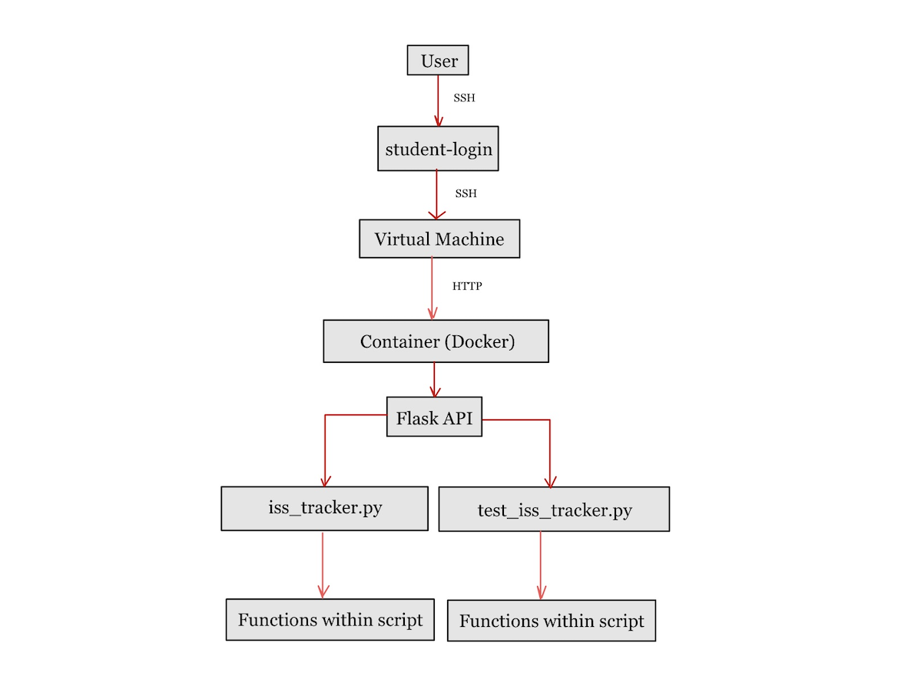

# Midterm: Analyze Data for the International Space Station (ISS)

## Overview:
This folder contains various methods analyzing different parts of the NASA International Space Station (ISS) Data, which can be useful to research and understand spatial behaviors. The methods incorporated in this project range from returning various aspects of the data, such as the header or the comments, to returning the space station’s current location, speed, and altitude. Each method is being run using a framework and was then tested to ensure that everything was working as intended.   

## Files:
    iss_tracker.py
    test_iss_tracker.py
    Dockerfile
    docker-compose.yml
    requirements.txt
    README.md

### iss_tracker.py
This file contains different routes to a Flask web application and essentially prints different aspects of the provided data set.
### test_iss_tracker.py
This file uses pytest to assert various test cases to ensure that the methods in the iss_tracker.py file are working correctly.
### Dockerfile
This file allows the user to run each script through a Docker container.
### docker-compose.yml
This file allows the user to run the Dockerfile commands efficiently. 

## Data
The testing data can be viewed on this website: https://spotthestation.nasa.gov/trajectory_data.cfm, however, the data is already being downloaded in the code, so nothing needs to be downloaded manually.

## Running code:
To run the code, install these packages: xmltodict, logging, requests, flask, and pytest. To do this run the following command in the terminal:
    
    pip3 install package_name

Additionally, make sure that Docker is installed on the system that is being used.

First, each file must be built in Docker. Enter this command:

    docker-compose build

Then, the data must be mounted into the container at run time to make this more efficient. To do this, enter the following command:

    docker-compose up -d

After this command is run, the web application should be able to be accessed from your local machine. To access the Flask routes open a new terminal window and run these commands:

Note: I used port 8080 because port 5000 doesn't work on my local machine. In most cases, port 5000 is used.

To return the ‘comment’ list object from ISS data use:

    curl http://localhost:8080/comment
To return the ‘header’ list object from ISS data use:

    curl http://localhost:8080/header
To return the ‘metadata’ list object from ISS data use:

    curl http://localhost:8080/metadata

To return the entire data set use:

    curl "http://localhost:8080/epochs"
To return a modified list use:

    curl "http://localhost:8080/epochs?limit=int&offset=int"
Example:

    curl "http://localhost:8080/epochs?limit=2&offset=12"
The limit and offset values can be replaced with any integer, as long as it doesn't exceed the length of the data set.

To return the state vectors for a specific Epoch from the data set use:

    curl http://localhost:8080/epochs/<epoch>
Example:

    curl http://localhost:8080/epochs/2024-059T12:00:00.000Z
To return the instantaneous speed for a specific Epoch in the data set use:

    curl http://localhost:8080/epochs/epochs/<epoch>/speed
Example:

    curl http://localhost:8080/epochs/2024-059T12:00:00.000Z/speed
To return the latitude, longitude, altitude, and geoposition for a specific Epoch in the data set use:

	curl http://localhost:8080/epochs/<epoch>/location
Example:

	curl http://localhost:8080/epochs 2024-059T12:00:00.000Z/location
To return the instantaneous speed, latitude, longitude, altitude, and geoposition for the Epoch that is nearest in time​​ use:

    curl http://localhost:8080/now

Once you are done accessing the routes in this file, type "Ctrl C" into the original terminal to end the session.

Then, to test the functions you can run the test_iss_tracker.py file:

    pytest test/test_iss_tracker.py

Finally, to close the Flask Application, the user can enter:

	docker-compose down

## Interpreting results
Example outputs from iss_tracker.py:

Route: /epochs

    ...
                        </stateVector>
                    <stateVector>
                        <EPOCH>2024-074T11:52:00.000Z</EPOCH>
                        <X units="km">2710.2566526954502</X>
                        <Y units="km">-3621.0122998115298</Y>
                        <Z units="km">-5079.7251522726701</Z>
                        <X_DOT units="km/s">4.4542068651597599</X_DOT>
                        <Y_DOT units="km/s">5.9382695516117199</Y_DOT>
                        <Z_DOT units="km/s">-1.85244686316331</Z_DOT>
                    </stateVector>
                    <stateVector>
                        <EPOCH>2024-074T11:56:00.000Z</EPOCH>
                        <X units="km">3668.3211129567999</X>
                        <Y units="km">-2082.0815576864002</Y>
                        <Z units="km">-5334.6760665273596</Z>
                        <X_DOT units="km/s">3.4811945770592398</X_DOT>
                        <Y_DOT units="km/s">6.8082718550259198</Y_DOT>
                        <Z_DOT units="km/s">-0.25921809840249999</Z_DOT>
                    </stateVector>
                    <stateVector>
                        <EPOCH>2024-074T12:00:00.000Z</EPOCH>
                        <X units="km">4361.0105068273897</X>
                        <Y units="km">-392.52963816617802</Y>
                        <Z units="km">-5202.6075373420399</Z>
                        <X_DOT units="km/s">2.25603844265299</X_DOT>
                        <Y_DOT units="km/s">7.1858437146965803</Y_DOT>
                        <Z_DOT units="km/s">1.35323694656583</Z_DOT>
                    </stateVector>
    ...
Route: /comment

    "Units are in kg and m^2",
    "MASS=471702.00",
    "DRAG_AREA=1487.80",
    "DRAG_COEFF=2.00",
    "SOLAR_RAD_AREA=0.00",
    "SOLAR_RAD_COEFF=0.00",
    "Orbits start at the ascending node epoch",
    "ISS first asc. node: EPOCH = 2024-03-08T12:23:51.689 $ ORBIT = 293 $ LAN(DEG) = 101.66397",
    "ISS last asc. node : EPOCH = 2024-03-23T11:31:42.924 $ ORBIT = 525 $ LAN(DEG) = 25.88236",
    "Begin sequence of events",
    "TRAJECTORY EVENT SUMMARY:",

Route: /header

    {
    "CREATION_DATE": "2024-068T18:36:27.254Z",
    "ORIGINATOR": "JSC"
    }

Route: /metadata

    {
    "CENTER_NAME": "EARTH",
    "OBJECT_ID": "1998-067-A",
    "OBJECT_NAME": "ISS",
    "REF_FRAME": "EME2000",
    "START_TIME": "2024-068T12:00:00.000Z",
    "STOP_TIME": "2024-083T12:00:00.000Z",
    "
    }

Route: /epochs?limit=int&offset=int

    <body><stateVector><EPOCH>2024-059T12:48:00.000Z</EPOCH><X units="km">4111.2692906714201</X><Y units="km">1757.44727655425</Y><Z units="km">-5121.1908337866998</Z><X_DOT units="km/s">-4.6133910033248204</X_DOT><Y_DOT units="km/s">5.8696180307571204</Y_DOT><Z_DOT units="km/s">-1.6855927241713</Z_DOT></stateVector><stateVector><EPOCH>2024-059T12:52:00.000Z</EPOCH><X units="km">2868.5544318211801</X><Y units="km">3085.4571782817102</Y><Z units="km">-5334.8177036651095</Z><X_DOT units="km/s">-5.6795817139153604</X_DOT><Y_DOT units="km/s">5.12984388235766</Y_DOT><Z_DOT units="km/s">-0.083791474597080001</Z_DOT></stateVector></body>%   

Route: /epochs/<epoch>

    {'EPOCH': '2024-059T12:00:00.000Z', 'X': {'@units': 'km', '#text': '-4510.2613026051904'}, 'Y': {'@units': 'km', '#text': '-1213.2390524027301'}, 'Z': {'@units': 'km', '#text': '4931.7882870748199'}, 'X_DOT': {'@units': 'km/s', '#text': '4.1230895860167003'}, 'Y_DOT': {'@units': 'km/s', '#text': '-6.0387139865514401'}, 'Z_DOT': {'@units': 'km/s', '#text': '2.2846027743012498'}}%    

Route: /epochs/<epoch>/speed

    7.66063601680933%

Route: /now

    closest epoch = {'EPOCH': '2024-061T04:02:00.000Z', 'X': {'@units': 'km', '#text': '-5185.7620711593399'}, 'Y': {'@units': 'km', '#text': '4051.6753192661499'}, 'Z': {'@units': 'km', '#text': '1685.6881587118801'}, 'X_DOT': {'@units': 'km/s', '#text': '-1.8600687837210199'}, 'Y_DOT': {'@units': 'km/s', '#text': '-4.7621051154374801'}, 'Z_DOT': {'@units': 'km/s', '#text': '5.7103977403494799'}} closest speed = 7.664603275032417%  

Additionally, below is the software diagram created for this project:

This image illustrates the connections between every component of this project needed to generate a final output. These components begin from the user, to the student-login, to the Virtual Machine, to the Docker container, to the Flask API, to the scripts, the functions within the scripts, and finally the final output. The diagram is useful to understand the flow of data and operations within the system.